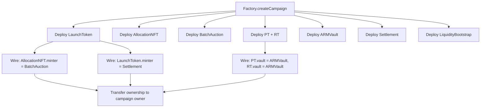
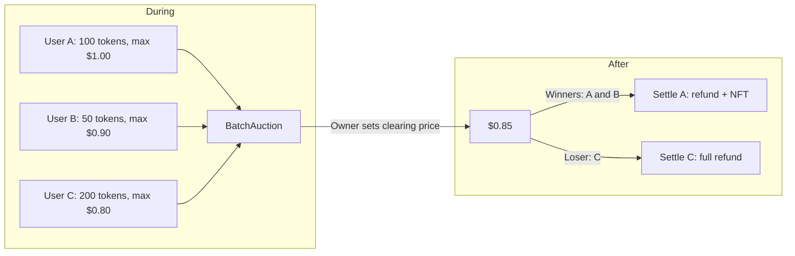
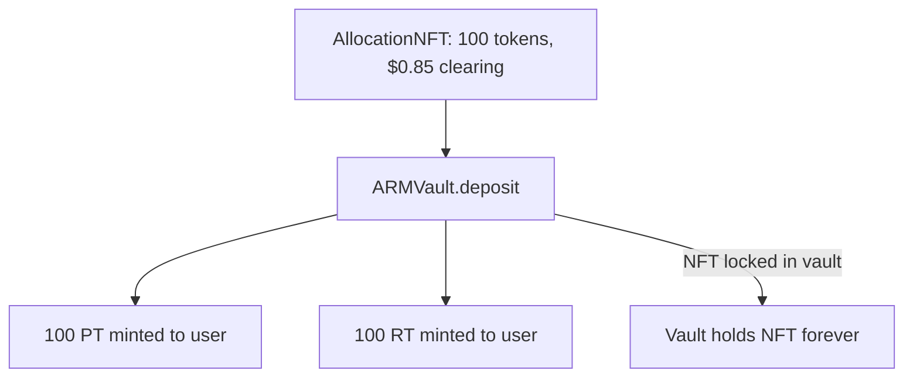
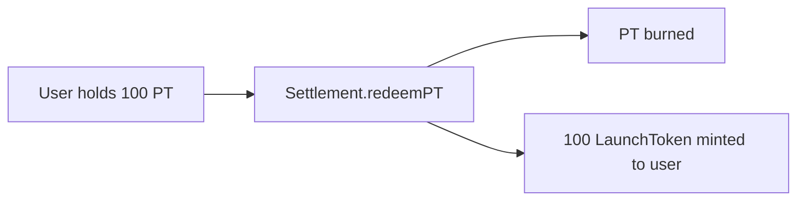
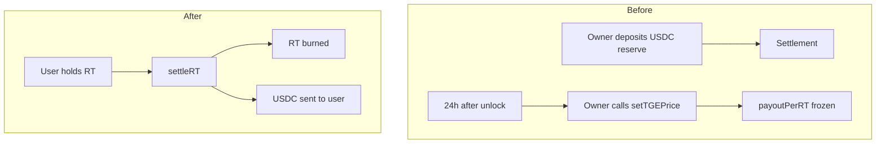
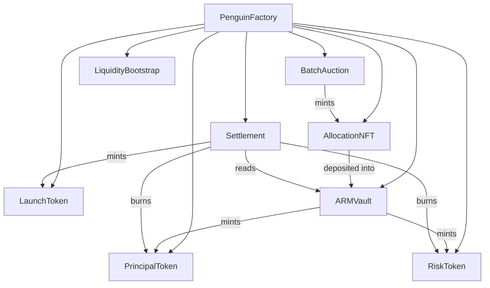

# Penguin Protocol - First Principles

A step-by-step explanation of the protocol from the ground up. No jargon. No shortcuts.

---

## What Problem Does This Solve?

You want to buy tokens before they launch. You pay now. You get tokens later. The question: how do you split your bet?

- **Option A (Stable):** You want your money back no matter what. You get 1 token per dollar you paid. If the token crashes, you still get your tokens. If it moons, you still get your tokens. Predictable.
- **Option B (Risky):** You want upside. You get paid the difference between the launch price and what you paid. If the token moons, you profit in USDC. If it crashes, you get nothing. Volatile.

Penguin lets you choose. One allocation splits into two: PT (Principal Token) for stability, RT (Risk Token) for upside.

---

## The Big Picture

```
[Factory] creates one campaign
    |
    v
[Batch Auction] -- users bid USDC for token allocation
    |
    v
[Allocation NFT] -- proof of your allocation
    |
    v
[ARMVault] -- deposit NFT, receive PT + RT (split)
    |
    v
[Settlement] -- after launch: PT -> LaunchToken, RT -> USDC
```

---

## Step 1: Campaign Creation

The factory deploys everything in one transaction. One campaign = one token launch.

**Contracts deployed per campaign:**

| Contract | Purpose |
| --- | --- |
| LaunchToken | The actual token that exists after launch |
| AllocationNFT | Receipt for your allocation (minted by auction) |
| BatchAuction | Where users bid USDC |
| PrincipalToken (PT) | Stable claim: 1 PT = 1 LaunchToken at unlock |
| RiskToken (RT) | Upside claim: pays (launch price - clearing price) in USDC |
| ARMVault | Converts AllocationNFT into PT + RT |
| Settlement | Redeems PT for LaunchToken, settles RT for USDC |
| LiquidityBootstrap | Holds USDC for market makers to seed Uniswap pools |

**Flow diagram:**



---

## Step 2: The Auction

Users bid during a time window. Each bid says: "I want X tokens, I will pay at most Y per token."

- User deposits: `tokenAmount * maxPrice` in USDC
- Auction closes
- Owner computes the clearing price (lowest price where demand meets supply)
- All winning bidders pay the same clearing price (uniform price)
- Excess USDC is refunded
- If oversubscribed, allocations are pro-rated

**Flow diagram:**



**Key invariant:** Clearing price is the lowest price at which total demand from bids at or above that price meets or exceeds total supply.

---

## Step 3: Allocation NFT

When you settle a winning bid, you receive an AllocationNFT. It stores:

- `amount`: how many tokens you are allocated
- `clearingPrice`: the price you paid per token
- `unlockTime`: when the LaunchToken goes live (TGE = Token Generation Event)

The NFT is a receipt. It does nothing by itself. You must deposit it into the ARMVault to get PT and RT.

---

## Step 4: Deposit into ARMVault (The Split)

You deposit your AllocationNFT. The vault burns it (figuratively: it transfers it to the vault permanently). In return, you receive:

- **PT (Principal Token):** amount = your allocation. 1 PT = right to redeem 1 LaunchToken at unlock.
- **RT (Risk Token):** amount = your allocation. 1 RT = right to receive (launch price - clearing price) in USDC, capped.

**Flow diagram:**



**Why split?** So you can sell PT to someone who wants stability, and RT to someone who wants upside. Or keep both. Your choice.

---

## Step 5: PT Redemption (After Unlock)

After `unlockTime`, PT holders can redeem. 1 PT burns, 1 LaunchToken mints. Simple 1:1.

**Flow diagram:**



---

## Step 6: RT Settlement (After TGE Price Is Set)

RT pays the upside. Formula: `max(0, min(launchPrice, clearingPrice * cap) - clearingPrice)` per RT.

- If launch price is below clearing price: RT pays 0 (you lose)
- If launch price is above clearing price: RT pays the difference, capped at `clearingPrice * (rtCapMultiplier - 1)`

**Timing:**

1. Auction ends
2. Unlock time passes (TGE)
3. Token trades on market for at least 24 hours (MIN_PRICE_DELAY)
4. Owner sets the TGE price (observed market price)
5. `payoutPerRT` is frozen: every RT holder gets the same rate
6. Users call `settleRT` to burn RT and receive USDC

**Flow diagram:**



**Pro-rata:** If the USDC reserve is insufficient to pay all RT holders at full rate, everyone gets a proportional share. No first-come advantage.

---

## Step 7: Liquidity Bootstrap

Separate from the user flow. The protocol allocates USDC for market makers to seed Uniswap v3 pools (PT/USDC, RT/USDC). Whitelisted MMs withdraw USDC, deploy liquidity externally, and report back on-chain. This enables trading of PT and RT before and after TGE.

---

## Contract Dependency Graph



---

## Summary Table

| Stage | User Action | Result |
| --- | --- | --- |
| Auction | Bid USDC | Deposit locked |
| Settlement (bid) | Settle winning bid | AllocationNFT + refund |
| Vault | Deposit NFT | PT + RT |
| Post-unlock | Redeem PT | LaunchToken |
| Post-TGE | Settle RT | USDC |

---

## Glossary

- **Clearing price:** The single price all winning bidders pay. Set by owner after auction ends.
- **PT (Principal Token):** Stable leg. Redeem 1:1 for LaunchToken at unlock.
- **RT (Risk Token):** Upside leg. Settles for (launch price - clearing price) in USDC, capped.
- **TGE:** Token Generation Event. When the LaunchToken becomes tradeable.
- **ARMVault:** Vault that splits AllocationNFT into PT and RT.

---

## Build and Test

```bash
forge build
forge test
```